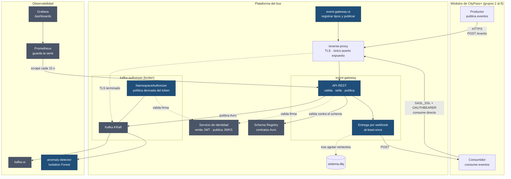
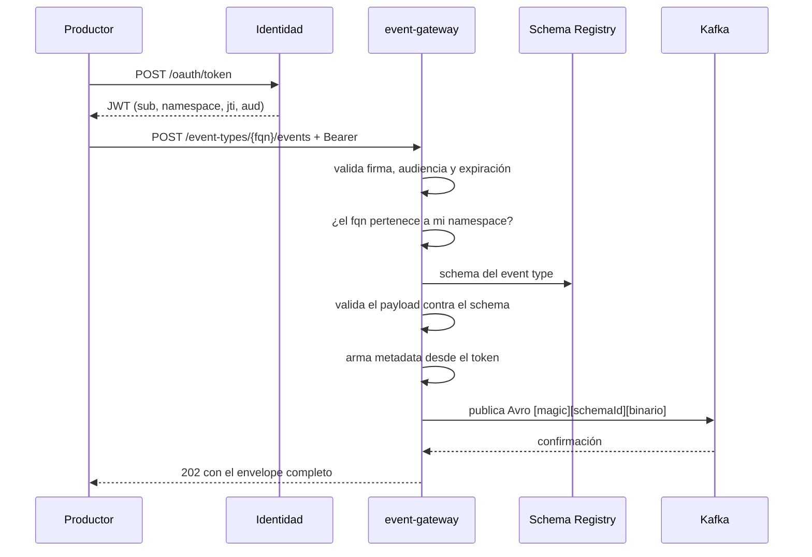
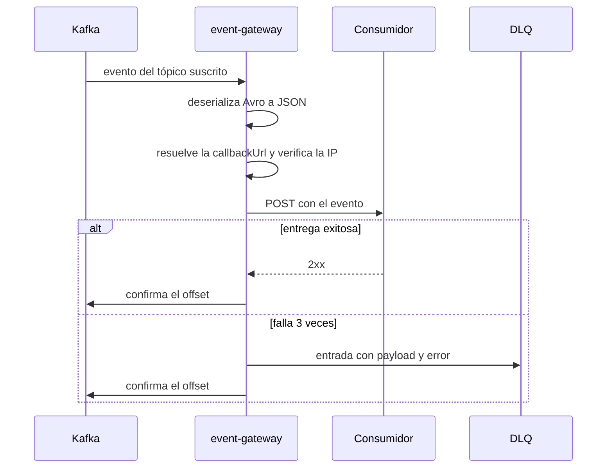

# Arquitectura

El bus de eventos de CityPass+: qué componentes lo forman, cómo se conectan y **por qué**
cada decisión se tomó así.

---

## Contenido

1. [El problema](#1-el-problema)
2. [Vista general](#2-vista-general)
3. [Los componentes](#3-los-componentes)
4. [Decisiones técnicas](#4-decisiones-técnicas)
5. [Flujos principales](#5-flujos-principales)
6. [Limitaciones conocidas](#6-limitaciones-conocidas)

---

## 1. El problema

Ocho equipos construyen módulos independientes de una plataforma urbana. Cuando alguien
devuelve una bicicleta, eso le interesa al módulo de movilidad que lo emite, pero también al
de analítica, y quizás mañana al de emergencias.

La solución obvia —que cada módulo llame por HTTP a los que le interesan— no escala:

- El emisor tiene que **saber quién lo escucha**. Sumar un consumidor obliga a tocar al
  productor.
- Si un consumidor está caído, **el productor falla** por algo que no es su problema.
- Ocho módulos que se llaman entre sí son hasta 56 integraciones para mantener.

Una **arquitectura orientada a eventos** invierte la relación: el productor anuncia que algo
pasó y se desentiende. Quien tenga interés se suscribe. El productor no sabe —ni necesita
saber— quién lo escucha, y sumar un consumidor no le cambia nada.

Este repositorio es la infraestructura que hace posible ese acuerdo: el bus, los contratos y
las políticas de publicación y suscripción.

---

## 2. Vista general

En azul lo que se construyó en este proyecto; en gris, componentes de terceros o de otros
grupos.

**Dos caminos de entrada y dos de salida.** Se publica siempre por HTTP contra el gateway.
Se consume de dos formas: conectándose directo a Kafka, o registrando un webhook para que el
gateway haga el POST.

---

## 3. Los componentes

### event-gateway

El corazón del sistema. Spring Boot con Kotlin.

Hace cuatro cosas:

1. **Registra event types**: valida el schema Avro, lo publica en el Schema Registry y crea
   el tópico.
2. **Publica eventos**: valida el payload contra el schema, le agrega la metadata, lo
   serializa a Avro y lo manda a Kafka.
3. **Entrega webhooks**: consume los tópicos suscritos y hace POST a las callbacks.
4. **Expone la Dead Letter Queue** y la consulta de eventos recientes.

### kafka-authorizer

Es la imagen del **broker Kafka** con un autorizador propio adentro. Se llama así y no
`kafka` porque lo que se construye en esa carpeta es el autorizador; el broker viene de la
imagen de Confluent.

Corre en modo KRaft con tres listeners:

| Listener | Puerto | Protocolo | Quién lo usa |
|---|---|---|---|
| `INTERNAL` | 29092 | PLAINTEXT | Los servicios del compose |
| `CONTROLLER` | 9093 | PLAINTEXT | El quórum de KRaft. Nunca sale del contenedor |
| `EXTERNAL` | 9092 | SASL_PLAINTEXT / SASL_SSL | Los grupos, autenticados con JWT |

### Schema Registry

El de Confluent. Guarda los schemas Avro y valida que su evolución sea compatible hacia
atrás. En producción no se publica: los grupos resuelven schemas por el gateway.

### Servicio de identidad

Emite los JWT y publica su clave pública en un JWKS. Hoy es `auth-simulator`, un mock que
entrega el Grupo 2 en su versión real.

### event-gateway-ui

Frontend en React. Permite registrar event types con un editor de schemas, publicar eventos
con un formulario generado a partir del schema, y ver los últimos eventos publicados.

### anomaly-detector

El componente de ML. Consume todos los tópicos de negocio y entrena un **Isolation Forest**
para detectar eventos anómalos, publicando sus hallazgos como eventos propios. Es también la
demostración de que la arquitectura funciona: es un consumidor más del bus, igual que
cualquier grupo.

### Prometheus y Grafana

El gateway expone sus métricas en un puerto aparte, pero sin nadie que las consulte sólo se
ve el valor instantáneo: no hay historial, y un reinicio pone los contadores en cero sin
dejar rastro. Prometheus las consulta cada 15 segundos y guarda la serie; Grafana la muestra.

El dashboard viene provisionado desde el repo, así que arranca funcionando: peticiones por
código, latencia p95, entregas de webhook por resultado y rechazos por rate limit. Los dos
últimos son los que responden «por qué un grupo dejó de recibir eventos», que no se puede
contestar desde los logs.

### reverse-proxy

Sólo en producción. Termina TLS y es el único servicio que escucha hacia afuera.

---

## 4. Decisiones técnicas

Cada decisión con su ADR, que documenta las opciones que se consideraron.

### Por qué Kafka y no una cola

Un bus de eventos no es una cola de trabajo. La diferencia que decidió: en Kafka **el
mensaje no se borra al leerlo**. Cada consumidor lleva su propio offset, así que ocho grupos
pueden leer el mismo evento sin coordinarse, y un grupo que se suma después puede releer el
histórico desde el principio.

Con RabbitMQ habría que crear una cola por consumidor y replicar cada mensaje en todas —el
productor tendría que saber cuántos consumidores hay, que es exactamente lo que se quería
evitar.

→ [ADR-001](adr/ADR-001-kafka-como-broker.md)

### Por qué Avro y no JSON

JSON no tiene contrato. Si el grupo 3 renombra un campo, los consumidores se enteran cuando
se les rompe la deserialización, en producción.

Avro obliga a declarar el schema, y el registry valida que cada cambio sea compatible hacia
atrás. Publicar algo que no cumple falla con un `400` que dice qué campo está mal, del lado
del productor y en el momento.

Además es binario y no repite los nombres de los campos en cada mensaje, lo que importa
cuando hay miles.

→ [ADR-002](adr/ADR-002-avro-schema-registry.md)

### Por qué un gateway HTTP delante del bus

Podríamos haberle dado a cada grupo credenciales de Kafka y que publicaran directo. No se
hizo por tres razones, en orden de peso:

1. **La metadata no sería confiable.** Si el productor escribe el evento entero, `source` es
   una afirmación suya. Con el gateway en el medio, sale del token.
2. **La validación llegaría tarde.** Sin gateway, un payload que no cumple el schema se
   detecta del lado del consumidor, al deserializar.
3. **La barrera de entrada sería alta.** Un `curl -X POST` lo hace cualquiera; un cliente
   Kafka con SASL y OAUTHBEARER bien configurado, no.

→ [ADR-003](adr/ADR-003-event-gateway.md)

### Por qué publicar por HTTP y consumir por Kafka

Es la asimetría central del diseño, y es deliberada.

**Escribir tiene un requisito de integridad**: el evento tiene que quedar sellado con datos
que el productor no controla. Eso exige un intermediario de confianza.

**Leer no lo tiene.** Los eventos ya vienen sellados y el consumidor no puede alterarlos, así
que no hay nada que proteger interponiéndose. Ahí conviene la ruta directa: es más eficiente,
permite control fino de offsets y releer el histórico.

Por eso el autorizador del broker permite `READ` y niega `WRITE` a los clientes externos: no
es una restricción pendiente de levantar, es el diseño.

Para los grupos que no quieran montar un consumidor Kafka están los webhooks, que son la
rampa de entrada — a costa de contrapresión y de tener que deduplicar.

### Por qué la metadata va en un record aparte

Un diseño anterior mezclaba los campos del gateway con los del productor en un solo record y
mantenía una lista de "campos reservados" que se validaba en cada publicación.

Esa lista es exactamente el tipo de cosa que se olvida de actualizar. Separando en dos
records, **la falsificación deja de ser posible en vez de estar prohibida**: no hay dónde
escribir la metadata desde el request. Y como efecto secundario desaparecen los nombres
reservados: un campo de negocio puede llamarse `source` sin pisar nada.

→ [ADR-012](adr/ADR-012-envelope-metadata-data.md)

### Por qué un tópico por tipo de evento

La alternativa era un tópico por dominio (`movilidad`) con eventos de varios tipos mezclados.

Un tópico por tipo permite que un consumidor se suscriba exactamente a lo que le interesa,
sin filtrar y descartar. Y hace que el schema del tópico sea uno solo, lo que simplifica la
deserialización y la evolución.

El costo es más tópicos, que con un solo broker no es un problema.

→ [ADR-006](adr/ADR-006-topico-por-tipo-de-evento.md)

### Por qué un autorizador propio y no ACLs

Las ACLs de Kafka son estado guardado en el cluster. Usarlas exigiría mantener una lista de
grupos sincronizada a mano con el servicio de identidad: **dos fuentes de verdad**, y la que
se desincroniza silenciosamente es siempre la de seguridad.

El autorizador propio deriva la política del propio JWT en cada conexión. No hay lista, no
hay estado, y dar de baja a un grupo en el emisor le corta el acceso al bus sin tocar nada
más.

→ [ADR-011](adr/ADR-011-autorizacion-derivada-del-token.md)

### Por qué la entrega de webhooks bloquea al consumidor

La entrega era asincrónica: el listener despachaba a un hilo y volvía enseguida. Eso hacía
que Kafka confirmara el offset **con el evento todavía sin entregar**, así que un reinicio en
ese momento lo perdía sin dejar ni una entrada en la DLQ.

Ahora el listener espera a que la entrega termine y el offset se confirma después. El costo
es contrapresión —un suscriptor lento frena su tópico— y que la entrega pasa a ser
*at-least-once*, o sea que puede haber duplicados.

Es el intercambio correcto: la alternativa es aceptar eventos más rápido de lo que se pueden
entregar y perderlos. Los suscriptores de un mismo evento se atienden en paralelo para que
el freno sea el más lento y no la suma, y hay timeouts para que un endpoint colgado no
bloquee el tópico para siempre.

→ [ADR-013](adr/ADR-013-entrega-at-least-once.md)

### Por qué KRaft

Un contenedor menos que con ZooKeeper, menos memoria, y alineado con la dirección de Kafka,
que va a remover ZooKeeper.

→ [ADR-004](adr/ADR-004-kraft-sin-zookeeper.md)

### Otras decisiones

| Decisión | ADR |
|---|---|
| Webhooks para suscripción | [ADR-005](adr/ADR-005-webhooks-para-suscripcion.md) |
| Serialización Avro manual, sin el serializer de Confluent | [ADR-007](adr/ADR-007-serializacion-avro-manual.md) |
| Persistencia de suscripciones en JSON | [ADR-008](adr/ADR-008-persistencia-webhooks-json.md) |
| Dead Letter Queue en un tópico de Kafka | [ADR-009](adr/ADR-009-dead-letter-queue.md) |
| Isolation Forest para detección de anomalías | [ADR-010](adr/ADR-010-isolation-forest-anomalias.md) |
| Un solo docker-compose con la configuración en el `.env` | [ADR-014](adr/ADR-014-un-compose-configuracion-en-env.md) |

---

## 5. Flujos principales

### Publicar un evento

Si Kafka no confirma dentro del tope, el gateway responde `504` y avisa que el evento
**puede haberse publicado igual** — el productor reintenta y deduplica por `payloadHash`.

### Consumir por webhook

El offset se confirma **después** de entregar o de registrar el fallo. Si el gateway muere
en el medio, el evento se vuelve a leer.

---

## 6. Limitaciones conocidas

| Limitación | Consecuencia | Qué haría falta |
|---|---|---|
| **Una sola instancia** | Las suscripciones y los archivados viven en archivos de un volumen local. Dos gateways divergen | Mover ese estado a un tópico compactado o a una base |
| **Rate limiting en memoria** | El límite es por instancia | Un contador compartido |
| **`GET /events` no es historial** | Lee la cola de los tópicos y filtra en memoria: no ve más atrás de esa ventana | Una proyección persistida, que es otro servicio |
| **Un broker** | Sin réplicas: si el disco se pierde, se pierden los eventos | Más brokers y factor de replicación > 1 |
| **TLS termina en el proxy** | El último salto viaja en claro por el bridge de Docker | Un keystore en el propio broker |
| **El emisor de identidad es un mock** | Clave efímera: cada reinicio invalida los tokens | El servicio del Grupo 2 |

---

## Referencias

- [SECURITY.md](SECURITY.md) — el modelo de seguridad completo
- [CONTRACTS.md](CONTRACTS.md) — políticas de contratos de eventos
- [DEPLOYMENT.md](DEPLOYMENT.md) — despliegue en la nube
- [docs/diagrams/](diagrams/) — C4, vista 4+1, secuencias y estados
- [docs/adr/](adr/) — las decisiones con sus alternativas
