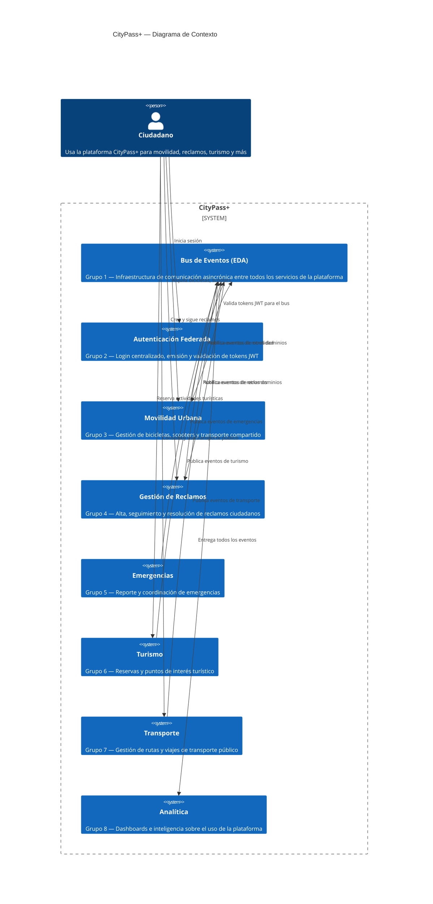

# C4 Nivel 1 — Diagrama de Contexto

Muestra CityPass+ como sistema y cómo interactúa con los actores externos.

```mermaid
C4Context
    title CityPass+ — Diagrama de Contexto

    Person(ciudadano, "Ciudadano", "Usa la plataforma CityPass+ para movilidad, reclamos, turismo y más")

    System_Boundary(citypass, "CityPass+") {
        System(eda, "Bus de Eventos (EDA)", "Grupo 1 — Infraestructura de comunicación asincrónica entre todos los servicios de la plataforma")
        System(auth, "Autenticación Federada", "Grupo 2 — Login centralizado, emisión y validación de tokens JWT")
        System(movilidad, "Movilidad Urbana", "Grupo 3 — Gestión de bicicletas, scooters y transporte compartido")
        System(reclamos, "Gestión de Reclamos", "Grupo 4 — Alta, seguimiento y resolución de reclamos ciudadanos")
        System(emergencias, "Emergencias", "Grupo 5 — Reporte y coordinación de emergencias")
        System(turismo, "Turismo", "Grupo 6 — Reservas y puntos de interés turístico")
        System(transporte, "Transporte", "Grupo 7 — Gestión de rutas y viajes de transporte público")
        System(analitica, "Analítica", "Grupo 8 — Dashboards e inteligencia sobre el uso de la plataforma")
    }

    Rel(ciudadano, movilidad, "Alquila bicicletas, scooters")
    Rel(ciudadano, reclamos, "Crea y sigue reclamos")
    Rel(ciudadano, turismo, "Reserva actividades turísticas")
    Rel(ciudadano, transporte, "Consulta y usa transporte público")
    Rel(ciudadano, auth, "Inicia sesión")

    Rel(movilidad, eda, "Publica eventos de movilidad")
    Rel(reclamos, eda, "Publica eventos de reclamos")
    Rel(emergencias, eda, "Publica eventos de emergencias")
    Rel(turismo, eda, "Publica eventos de turismo")
    Rel(transporte, eda, "Publica eventos de transporte")
    Rel(auth, eda, "Publica eventos de autenticación")

    Rel(eda, analitica, "Entrega todos los eventos")
    Rel(eda, movilidad, "Notifica eventos de otros dominios")
    Rel(eda, reclamos, "Notifica eventos de otros dominios")

    Rel(auth, eda, "Valida tokens JWT para el bus")

    UpdateLayoutConfig($c4ShapeInRow="3", $c4BoundaryInRow="1")
```
