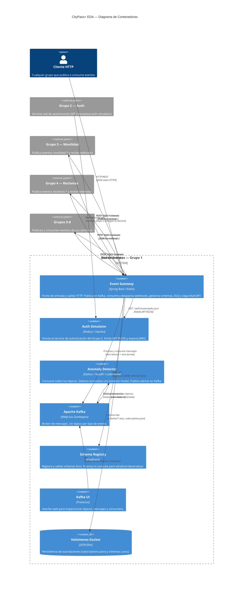

# C4 Nivel 2 — Diagrama de Contenedores

Muestra los contenedores (servicios Docker) que componen el Bus de Eventos (Grupo 1) y cómo interactúan con los demás grupos.

```mermaid
C4Container
    title CityPass+ EDA — Diagrama de Contenedores

    Person(cliente, "Cliente HTTP", "Cualquier grupo que publica o consume eventos")

    System_Boundary(eda, "Bus de Eventos — Grupo 1") {
        Container(event_gateway, "Event Gateway", "Spring Boot / Kotlin", "Punto de entrada y salida HTTP. Publica en Kafka, consume y despacha webhooks, gestiona schemas, DLQ y seguridad JWT.")
        Container(auth_simulator, "Auth Simulator", "Node.js / Express", "Simula el servicio de autenticación del Grupo 2. Emite JWT RS256 y expone JWKS.")
        Container(anomaly_detector, "Anomaly Detector", "Python / FastAPI / scikit-learn", "Consume todos los tópicos. Detecta anomalías con Isolation Forest. Publica alertas en Kafka.")
        Container(kafka, "Apache Kafka", "KRaft (sin ZooKeeper)", "Broker de mensajes. Un tópico por tipo de evento.")
        Container(schema_registry, "Schema Registry", "Confluent", "Registra y valida schemas Avro. El proxy lo consulta para serializar/deserializar.")
        Container(kafka_ui, "Kafka UI", "Provectus", "Interfaz web para inspeccionar tópicos, mensajes y consumers.")
        ContainerDb(volumes, "Volúmenes Docker", "JSON files", "Persistencia de suscripciones (subscriptions.json) y schemas (.avsc).")
    }

    System_Ext(grupo2, "Grupo 2 — Auth", "Servicio real de autenticación JWT (reemplaza auth-simulator)")
    System_Ext(grupo3, "Grupo 3 — Movilidad", "Publica eventos movilidad.* y recibe webhooks")
    System_Ext(grupo4, "Grupo 4 — Reclamos", "Publica eventos reclamos.* y recibe webhooks")
    System_Ext(grupoN, "Grupos 5-8", "Publican y consumen eventos de sus dominios")

    Rel(cliente, event_gateway, "HTTP/REST", "JSON sobre HTTPS")
    Rel(event_gateway, auth_simulator, "GET /.well-known/jwks.json", "Valida JWT RS256")
    Rel(event_gateway, schema_registry, "REST API", "Registra y valida schemas Avro")
    Rel(event_gateway, kafka, "Produce y consume mensajes", "Avro binario + wire format")
    Rel(event_gateway, volumes, "Lee/escribe", "schemas/*.avsc, subscriptions.json")
    Rel(event_gateway, grupo3, "HTTP POST webhook", "JSON deserializado")
    Rel(event_gateway, grupo4, "HTTP POST webhook", "JSON deserializado")
    Rel(event_gateway, grupoN, "HTTP POST webhook", "JSON deserializado")
    Rel(kafka, anomaly_detector, "Consume todos los tópicos", "Avro binario")
    Rel(anomaly_detector, kafka, "Publica anomalías", "sistema.anomalia.detectada")
    Rel(kafka_ui, kafka, "Lee", "Inspección de tópicos y mensajes")

    Rel(grupo3, event_gateway, "POST /api/v1/events", "Publica eventos")
    Rel(grupo4, event_gateway, "POST /api/v1/events", "Publica eventos")
    Rel(grupoN, event_gateway, "POST /api/v1/events", "Publica eventos")

    Rel_Back(auth_simulator, grupo2, "Reemplazado por", "Cuando Grupo 2 entregue su servicio")
```
