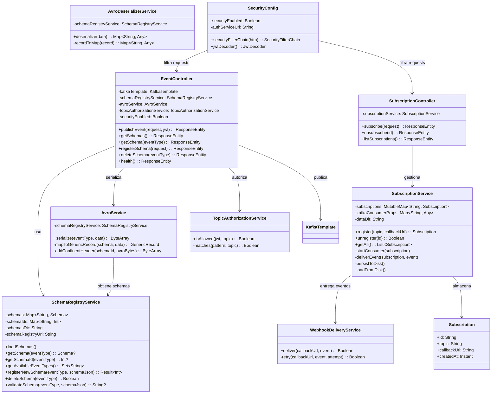
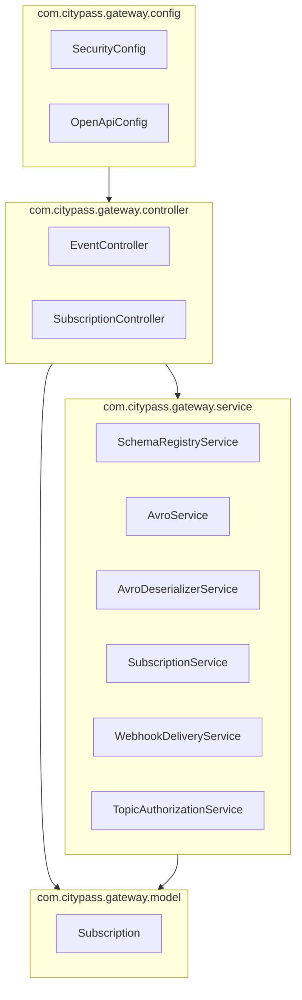

# Diagrama de Clases — Event Gateway (Vista Lógica 4+1)

Muestra las clases principales del Event Gateway, sus relaciones y responsabilidades.

```mermaid
classDiagram
    class EventController {
        -kafkaTemplate: KafkaTemplate
        -schemaRegistryService: SchemaRegistryService
        -avroService: AvroService
        -topicAuthorizationService: TopicAuthorizationService
        -securityEnabled: Boolean
        +publishEvent(request, jwt): ResponseEntity
        +getSchemas(): ResponseEntity
        +getSchema(eventType): ResponseEntity
        +registerSchema(request): ResponseEntity
        +deleteSchema(eventType): ResponseEntity
        +health(): ResponseEntity
    }

    class SubscriptionController {
        -subscriptionService: SubscriptionService
        +subscribe(request): ResponseEntity
        +unsubscribe(id): ResponseEntity
        +listSubscriptions(): ResponseEntity
    }

    class SchemaRegistryService {
        -schemas: Map~String, Schema~
        -schemaIds: Map~String, Int~
        -schemasDir: String
        -schemaRegistryUrl: String
        +loadSchemas()
        +getSchema(eventType): Schema?
        +getSchemaId(eventType): Int?
        +getAvailableEventTypes(): Set~String~
        +registerNewSchema(eventType, schemaJson): Result~Int~
        +deleteSchema(eventType): Boolean
        +validateSchema(eventType, schemaJson): String?
    }

    class AvroService {
        -schemaRegistryService: SchemaRegistryService
        +serialize(eventType, data): ByteArray
        -mapToGenericRecord(schema, data): GenericRecord
        -addConfluentHeader(schemaId, avroBytes): ByteArray
    }

    class AvroDeserializerService {
        -schemaRegistryService: SchemaRegistryService
        +deserialize(data): Map~String, Any~
        -recordToMap(record): Map~String, Any~
    }

    class SubscriptionService {
        -subscriptions: MutableMap~String, Subscription~
        -kafkaConsumerProps: Map~String, Any~
        -dataDir: String
        +register(topic, callbackUrl): Subscription
        +unregister(id): Boolean
        +getAll(): List~Subscription~
        -startConsumer(subscription)
        -deliverEvent(subscription, event)
        -persistToDisk()
        -loadFromDisk()
    }

    class WebhookDeliveryService {
        +deliver(callbackUrl, event): Boolean
        -retry(callbackUrl, event, attempt): Boolean
    }

    class TopicAuthorizationService {
        +isAllowed(jwt, topic): Boolean
        -matches(pattern, topic): Boolean
    }

    class SecurityConfig {
        -securityEnabled: Boolean
        -authServiceUrl: String
        +securityFilterChain(http): SecurityFilterChain
        +jwtDecoder(): JwtDecoder
    }

    class Subscription {
        +id: String
        +topic: String
        +callbackUrl: String
        +createdAt: Instant
    }

    EventController --> SchemaRegistryService : usa
    EventController --> AvroService : serializa
    EventController --> TopicAuthorizationService : autoriza
    EventController --> KafkaTemplate : publica

    SubscriptionController --> SubscriptionService : gestiona

    AvroService --> SchemaRegistryService : obtiene schemas

    SubscriptionService --> WebhookDeliveryService : entrega eventos
    SubscriptionService --> Subscription : almacena

    SecurityConfig --> EventController : filtra requests
    SecurityConfig --> SubscriptionController : filtra requests
```

## Paquetes

```mermaid
graph TD
    subgraph controller["com.citypass.gateway.controller"]
        EC[EventController]
        SC[SubscriptionController]
    end

    subgraph service["com.citypass.gateway.service"]
        SRS[SchemaRegistryService]
        AS[AvroService]
        ADS[AvroDeserializerService]
        SS[SubscriptionService]
        WDS[WebhookDeliveryService]
        TAS[TopicAuthorizationService]
    end

    subgraph config["com.citypass.gateway.config"]
        SEC[SecurityConfig]
        OAC[OpenApiConfig]
    end

    subgraph model["com.citypass.gateway.model"]
        SUB[Subscription]
    end

    controller --> service
    controller --> model
    service --> model
    config --> controller
```
