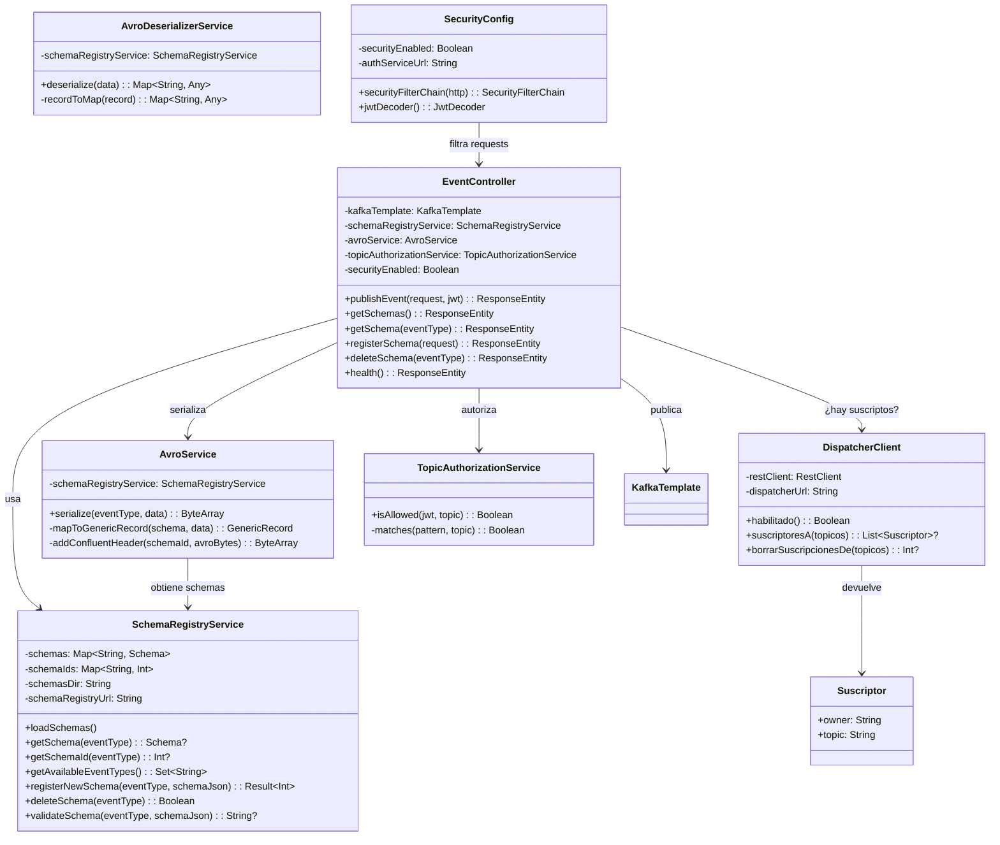
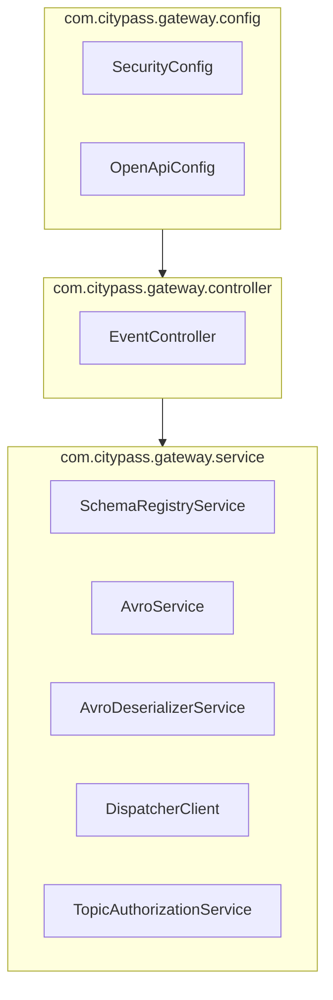

# Diagrama de Clases — Event Gateway (Vista Lógica 4+1)

Muestra las clases principales del Event Gateway, sus relaciones y responsabilidades.

Las de webhooks se fueron al `webhook-dispatcher`
([ADR-020](../adr/ADR-020-webhooks-en-su-propio-servicio.md)); están en
[clases-webhook-dispatcher.md](clases-webhook-dispatcher.md).

## Paquetes

