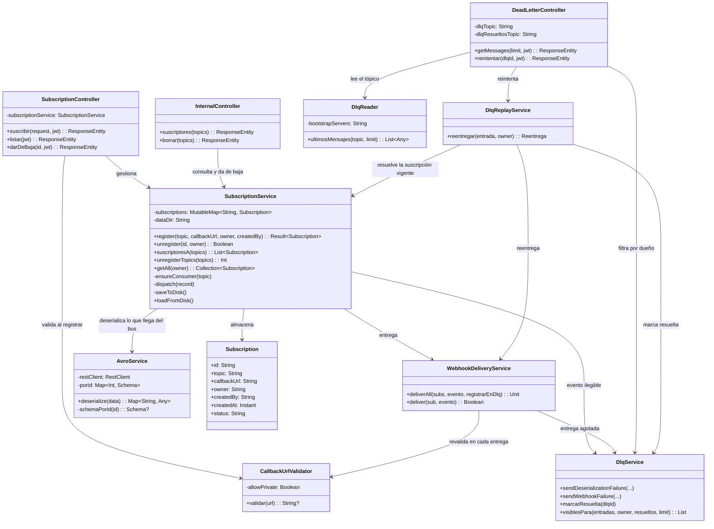
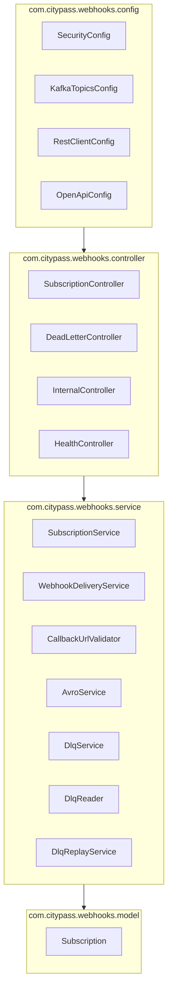

# Diagrama de Clases — Webhook Dispatcher (Vista Lógica 4+1)

Las clases del servicio que atiende las suscripciones y entrega los eventos por HTTP.

Salieron del `event-gateway` en el [ADR-020](../adr/ADR-020-webhooks-en-su-propio-servicio.md).
Lo que llegó nuevo con la mudanza es `AvroService` —acá es **sólo de lectura**, porque el
dispatcher nunca serializa— y `InternalController`, que es por donde el gateway pregunta.

## Dos cosas que el diagrama no muestra y conviene saber

**`CallbackUrlValidator` aparece dos veces a propósito.** Se valida al registrar y **en cada
entrega**: validar sólo al registrar no sirve contra DNS rebinding, porque el dueño de un
dominio puede devolver una IP pública al registro y una privada después
([SECURITY.md](../SECURITY.md#ssrf-por-webhooks)).

**`AvroService` habla con el Schema Registry, no con el gateway.** El gateway también sirve
schemas por id, pero pedírselos a él lo pondría en el camino de la entrega: si se cayera, el
dispatcher dejaría de poder interpretar eventos que ya están en el bus, y son dos cosas que
no tienen por qué caerse juntas.

## Paquetes

