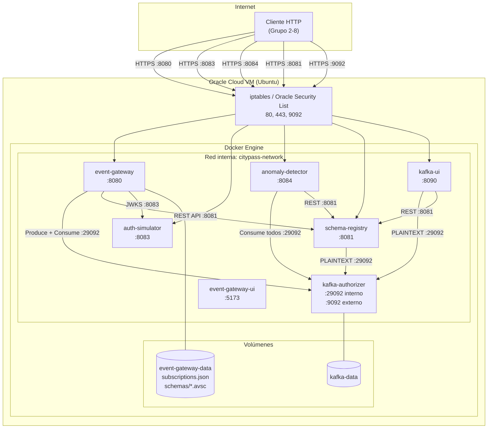

# Diagrama de Despliegue

Muestra cómo los contenedores Docker se distribuyen en la VM de Oracle Cloud.



## Notas de red

| Puerto | Expuesto al exterior | Servicio |
|---|---|---|
| 9092 | Sí | Kafka (conexión directa desde fuera de Docker) |
| 8080 | Sí | Event Gateway (publicación, webhooks, schemas, DLQ) |
| 8081 | Sí | Schema Registry |
| 8083 | Sí | Auth Simulator |
| 8084 | Sí | Anomaly Detector |
| 8090 | Sí | Kafka UI |
| 29092 | No (solo interno) | Kafka (comunicación entre contenedores) |

## Orden de arranque (Docker Compose `depends_on`)

```
auth-simulator (healthcheck)
  └── kafka-authorizer (healthcheck)          el broker valida los JWT contra su JWKS
        ├── schema-registry (healthcheck)
        │     ├── event-gateway (healthcheck)
        │     │     └── event-gateway-ui
        │     ├── anomaly-detector
        │     └── kafka-ui
        └── (event-gateway, anomaly-detector y kafka-ui también esperan a schema-registry)
```
