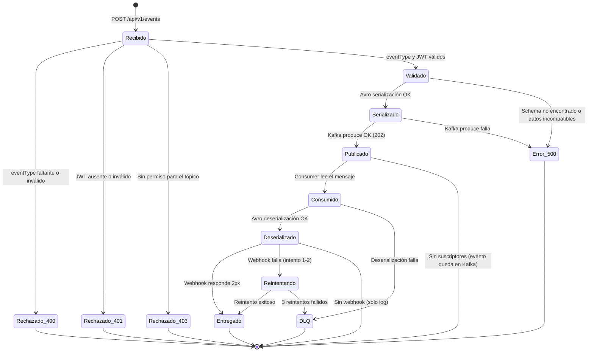
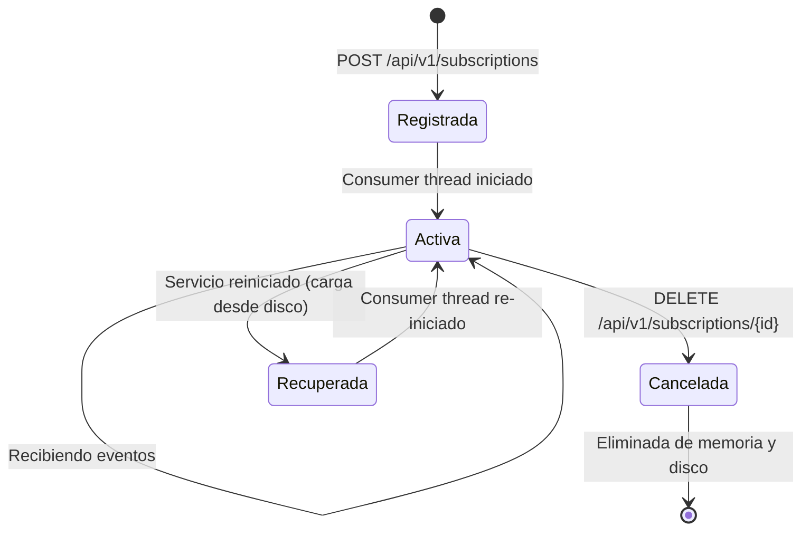
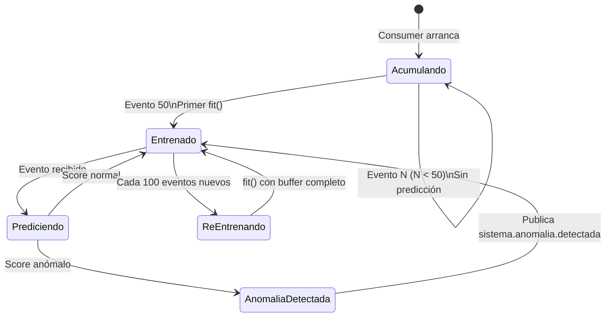

# Diagramas de Estado

## 1. Ciclo de vida de un evento

Desde que un cliente envía un evento hasta su entrega final o envío a la DLQ.

---

## 2. Ciclo de vida de una suscripción webhook

---

## 3. Ciclo de vida del modelo Isolation Forest

