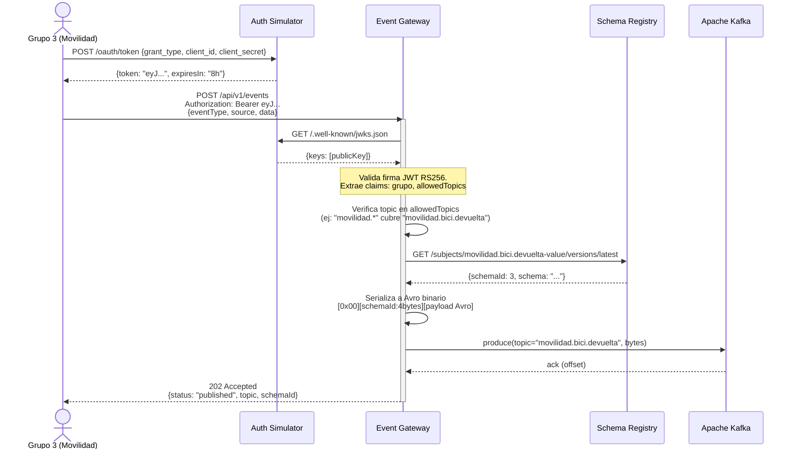
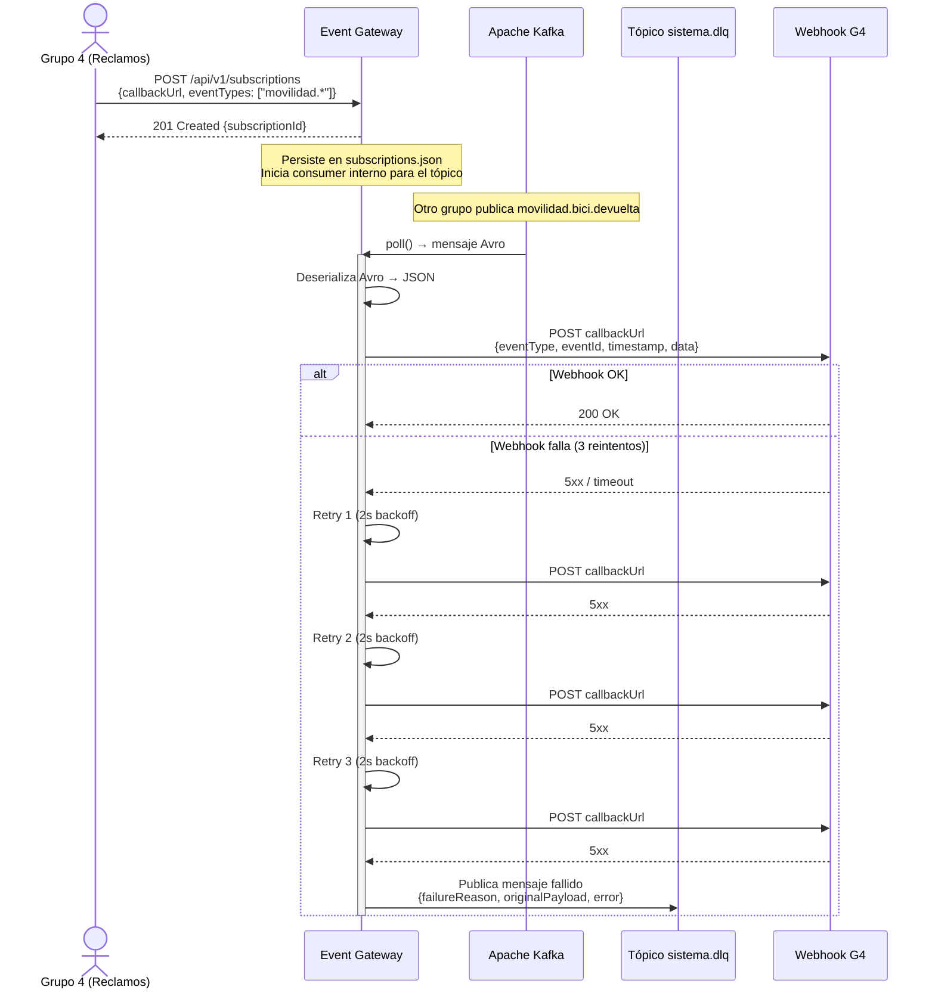
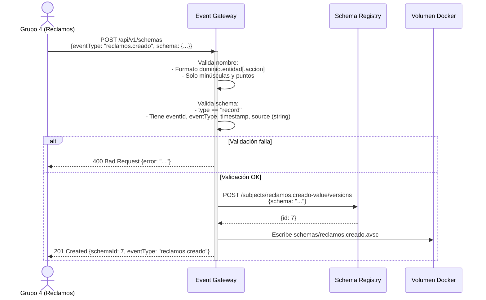

# Diagramas de Secuencia

## 1. Publicación de un evento (con seguridad activada)

```mermaid
sequenceDiagram
    actor G3 as Grupo 3 (Movilidad)
    participant Auth as Auth Simulator
    participant Proxy as Event Gateway
    participant SR as Schema Registry
    participant Kafka as Apache Kafka

    G3->>Auth: POST /oauth/token {grant_type, client_id, client_secret}
    Auth-->>G3: {token: "eyJ...", expiresIn: "8h"}

    G3->>Proxy: POST /api/v1/events<br/>Authorization: Bearer eyJ...<br/>{eventType, source, data}
    
    activate Proxy
    Proxy->>Auth: GET /.well-known/jwks.json
    Auth-->>Proxy: {keys: [publicKey]}
    Note over Proxy: Valida firma JWT RS256.<br/>Extrae claims: grupo, allowedTopics

    Proxy->>Proxy: Verifica topic en allowedTopics<br/>(ej: "movilidad.*" cubre "movilidad.bici.devuelta")

    Proxy->>SR: GET /subjects/movilidad.bici.devuelta-value/versions/latest
    SR-->>Proxy: {schemaId: 3, schema: "..."}

    Proxy->>Proxy: Serializa a Avro binario<br/>[0x00][schemaId:4bytes][payload Avro]

    Proxy->>Kafka: produce(topic="movilidad.bici.devuelta", bytes)
    Kafka-->>Proxy: ack (offset)
    
    Proxy-->>G3: 202 Accepted<br/>{status: "published", topic, schemaId}
    deactivate Proxy
```

---

## 2. Entrega de evento via webhook

```mermaid
sequenceDiagram
    actor G4 as Grupo 4 (Reclamos)
    participant Proxy as Event Gateway
    participant Kafka as Apache Kafka
    participant DLQ as Tópico sistema.dlq
    participant Hook as Webhook G4

    G4->>Proxy: POST /api/v1/subscriptions<br/>{callbackUrl, eventTypes: ["movilidad.*"]}
    Proxy-->>G4: 201 Created {subscriptionId}
    Note over Proxy: Persiste en subscriptions.json<br/>Inicia consumer interno para el tópico

    Note over Kafka: Otro grupo publica movilidad.bici.devuelta

    Kafka->>Proxy: poll() → mensaje Avro
    activate Proxy
    Proxy->>Proxy: Deserializa Avro → JSON

    Proxy->>Hook: POST callbackUrl<br/>{eventType, eventId, timestamp, data}
    
    alt Webhook OK
        Hook-->>Proxy: 200 OK
    else Webhook falla (3 reintentos)
        Hook-->>Proxy: 5xx / timeout
        Proxy->>Proxy: Retry 1 (2s backoff)
        Proxy->>Hook: POST callbackUrl
        Hook-->>Proxy: 5xx
        Proxy->>Proxy: Retry 2 (2s backoff)
        Proxy->>Hook: POST callbackUrl
        Hook-->>Proxy: 5xx
        Proxy->>Proxy: Retry 3 (2s backoff)
        Proxy->>Hook: POST callbackUrl
        Hook-->>Proxy: 5xx
        Proxy->>DLQ: Publica mensaje fallido<br/>{failureReason, originalPayload, error}
    end
    deactivate Proxy
```

---

## 3. Registro de un schema nuevo

```mermaid
sequenceDiagram
    actor G4 as Grupo 4 (Reclamos)
    participant Proxy as Event Gateway
    participant SR as Schema Registry
    participant Disk as Volumen Docker

    G4->>Proxy: POST /api/v1/schemas<br/>{eventType: "reclamos.creado", schema: {...}}

    activate Proxy
    Proxy->>Proxy: Valida nombre:<br/>- Formato dominio.entidad[.accion]<br/>- Solo minúsculas y puntos

    Proxy->>Proxy: Valida schema:<br/>- type == "record"<br/>- Tiene eventId, eventType, timestamp, source (string)

    alt Validación falla
        Proxy-->>G4: 400 Bad Request {error: "..."}
    else Validación OK
        Proxy->>SR: POST /subjects/reclamos.creado-value/versions<br/>{schema: "..."}
        SR-->>Proxy: {id: 7}

        Proxy->>Disk: Escribe schemas/reclamos.creado.avsc

        Proxy-->>G4: 201 Created {schemaId: 7, eventType: "reclamos.creado"}
    end
    deactivate Proxy
```
