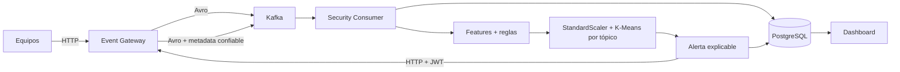

# CityPass+ Security

Security observa los eventos de negocio de Kafka, conserva cada decisión en PostgreSQL y combina reglas determinísticas con K-Means por tópico. Una anomalía **no prueba un ataque**: indica un evento suficientemente distinto que requiere revisión.

## Flujo



## Ejecutar

Desde la raíz: `docker compose up -d --build`. API: `http://localhost:8084`; dashboard: `http://localhost:8501`; Kafka UI: `http://localhost:8090`. Migraciones: `docker compose exec security alembic upgrade head`. Tests locales: `cd microservices/security; pytest`.

El backend se suscribe con la regex POSIX `^com\.citypass\..+` y, antes de deserializar o analizar, descarta explícitamente todo tópico con prefijo `com.citypass.security.`. Así evita loops sin depender de lookaheads que `librdkafka` no soporta. Usa el grupo `security-analysis-group`. PostgreSQL es la fuente de verdad; CSV sólo es una exportación en `/api/v1/security/export/events.csv`.

## Carpetas

- `app/database`: tablas y sesiones SQLAlchemy.
- `app/kafka`: consumo y deserialización Avro.
- `app/gateway`: autenticación OAuth2 y publicación de alertas por Event Gateway.
- `contracts`: campos del event type `AlertaDetectada`.
- `app/analytics`: features, firma estructural, escalado, K-Means y riesgo.
- `app/security`: transacción de análisis.
- `app/api`: API paginada y acknowledge.
- `dashboard`: visualización Streamlit.
- `alembic`: migración inicial.
- `tests`: pruebas unitarias e integración optativa.
- `docs`: explicación progresiva y guía de demo.

Empezá por [01-INTRODUCCION.md](docs/01-INTRODUCCION.md).

## Objetivo y alcance

El servicio responde a una pregunta operativa: “¿apareció un evento suficientemente distinto de los patrones habituales como para revisarlo?”. No intenta declarar automáticamente que hubo un ataque. Conserva evidencia y explica qué señales produjeron la alerta.

Tecnologías: Python 3.12, FastAPI, confluent-kafka, fastavro, SQLAlchemy 2, Alembic, PostgreSQL 17, NumPy, scikit-learn y Streamlit.

## Configuración principal

| Variable | Default local | Uso |
|---|---:|---|
| `KAFKA_BOOTSTRAP_SERVERS` | `kafka-authorizer:29092` | Broker interno |
| `SCHEMA_REGISTRY_URL` | `http://schema-registry:8081` | Resolución de schemas |
| `DATABASE_URL` | PostgreSQL `security-db` | Persistencia |
| `MIN_TRAINING_SAMPLES` | 50 | Warm-up por tópico |
| `RETRAIN_EVERY_N_EVENTS` | 100 | Frecuencia de reentrenamiento |
| `MODEL_WINDOW_SIZE` | 2000 | Máximo de normales consultados |
| `MIN_CLUSTERS` / `MAX_CLUSTERS` | 2 / 6 | Candidatos para K |
| `DISTANCE_PERCENTILE` | 95 | Threshold independiente por cluster |
| `ALERT_COOLDOWN_SECONDS` | 300 | Deduplicación temporal |
| `SECURITY_GATEWAY_CLIENT_ID/SECRET` | `security` / local | OAuth2 de servicio; reemplazar fuera de desarrollo |
| `ALERT_RETRY_INTERVAL_SECONDS` | 30 | Reintento de publicaciones pendientes/fallidas |
| `ALERT_MAX_PUBLICATION_ATTEMPTS` | 10 | Evita reintentos ilimitados |

## Migraciones y arranque

El entrypoint ejecuta `alembic upgrade head` antes de Uvicorn. La migración inicial contiene operaciones explícitas; no usa `Base.metadata.create_all()`. Para comprobar reversibilidad en un entorno descartable:

```bash
docker compose exec security alembic downgrade base
docker compose exec security alembic upgrade head
```

## API

Además de `/health`, existen status, eventos, clusters, modelos y alertas paginados; detalle de evento/alerta; `PATCH` de acknowledge/review; y exportaciones CSV de eventos y alertas. FastAPI publica el contrato interactivo en `http://localhost:8084/docs`.

## Demo y pruebas

```bash
docker compose exec security python scripts/generate_demo_events.py --normal 100 --anomalous 5
cd microservices/security
pytest tests/unit -q
SECURITY_INTEGRATION=1 pytest tests/integration -q
```

La demo consulta la API de modelos hasta que aparece el entrenamiento; no depende de un sleep largo. La integración requiere Docker/PostgreSQL. Consultá [11-PRUEBAS.md](docs/11-PRUEBAS.md) y [12-DEMO-PASO-A-PASO.md](docs/12-DEMO-PASO-A-PASO.md).
