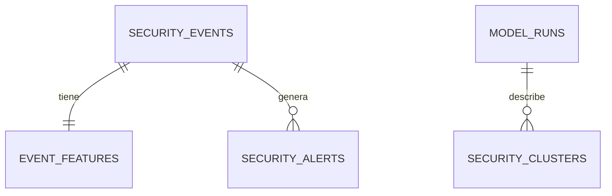

# PostgreSQL

Una tabla agrupa filas; cada columna tiene significado y tipo. La primary key identifica una fila, una foreign key relaciona tablas, un índice acelera búsquedas, un unique constraint impide duplicados y una transacción aplica todos los cambios o ninguno. JSONB conserva payloads flexibles y consultables.

`security_events` guarda posición Kafka, envelope, firma y assignment. `event_features` audita el vector. `model_runs` y `security_clusters` explican entrenamientos. `security_alerts` guarda señales, severidad, acknowledge y revisión.

CSV sirve para exportar, pero no aporta transacciones, índices ni concurrencia. SQLite es excelente localmente, pero un consumer y dashboard concurrentes se acercan más a PostgreSQL. MongoDB es atractivo para JSON, aunque aquí importan relaciones y agregaciones SQL; PostgreSQL ya aporta JSONB. MySQL/MariaDB también serían válidos, pero PostgreSQL combina JSONB maduro, SQL e integridad sin sumar otra tecnología al diseño.

## Conceptos desde cero

Una base de datos es un sistema que conserva información y permite consultarla aunque el proceso se reinicie. SQL es el lenguaje usado para consultar y modificar bases relacionales. Una tabla se parece a una planilla con reglas: cada fila representa una entidad y cada columna un atributo tipado. La primary key identifica una fila; una foreign key exige que una relación apunte a una fila válida.

Un índice mantiene una estructura adicional para encontrar filas sin recorrer toda la tabla. Por eso se indexan fecha, tópico, source, severidad y firmas, pero no cada columna. Un constraint protege invariantes incluso si un bug intenta violarlas: por ejemplo, risk debe estar entre 0 y 100. Una transacción agrupa operaciones; si una falla, ninguna queda aplicada. JSONB almacena JSON en formato binario consultable, adecuado para payloads cuyos campos dependen del event type.

## Tablas y relaciones

- `security_events`: fuente de verdad de cada posición Kafka. El unique constraint de tópico, partición y offset hace idempotente una reentrega.
- `event_features`: vector exacto usado para decidir, uno por evento. Se elimina en cascada con su evento.
- `model_runs`: auditoría del entrenamiento, K, Silhouette, muestras y versión.
- `security_clusters`: centroides y threshold de cada cluster, ligados a tópico/versión.
- `security_alerts`: explicación, score, señales, acknowledge, revisión y estado durable de publicación (`PENDING/PUBLISHED/FAILED`, intentos, error y eventId asignado por gateway).

## Migraciones y Alembic

Una migración es una receta versionada para transformar el esquema. Alembic ejecuta `upgrade()` en orden y `downgrade()` en reversa. `alembic/versions/0001_initial.py` crea explícitamente tablas, PK, FK, índices y checks; así una base vacía se reproduce sin depender del código de arranque.

## Comparación

| Opción | Ventaja | Motivo de no elegirla como fuente principal |
|---|---|---|
| CSV | Portable y simple para datasets | Sin transacciones, relaciones, índices ni escritura concurrente segura |
| SQLite | Excelente para prototipos locales | Un archivo y menor ajuste al patrón consumer/API/dashboard concurrente |
| MongoDB | Documentos JSON naturales | Las relaciones y agregaciones temporales son centrales; JSONB cubre flexibilidad |
| MySQL/MariaDB | Relacional, maduro y válido | PostgreSQL ofrece JSONB e integración ya elegida; cambiar no aporta valor aquí |
| PostgreSQL | SQL, integridad, concurrencia, JSONB | Mayor operación que un archivo; aceptada mediante Docker |
