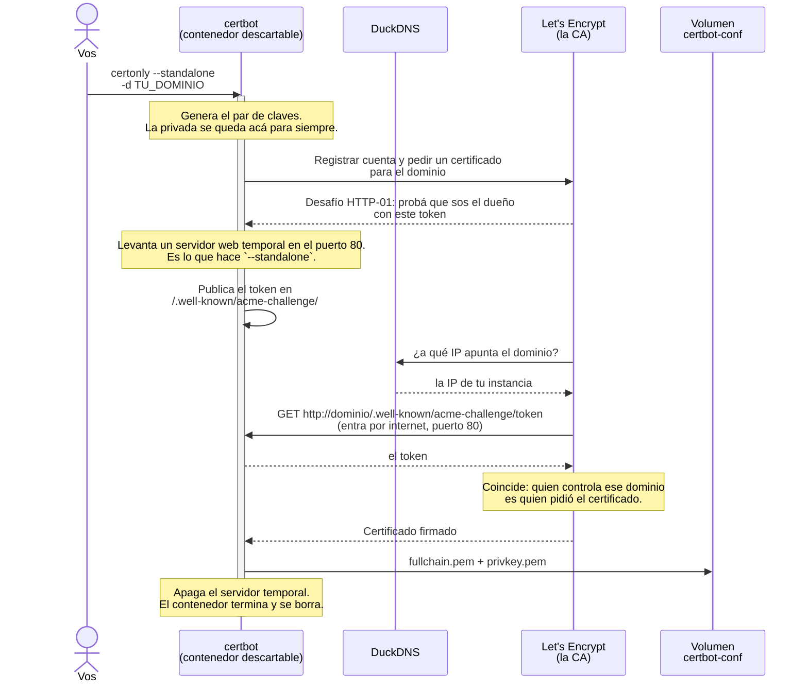
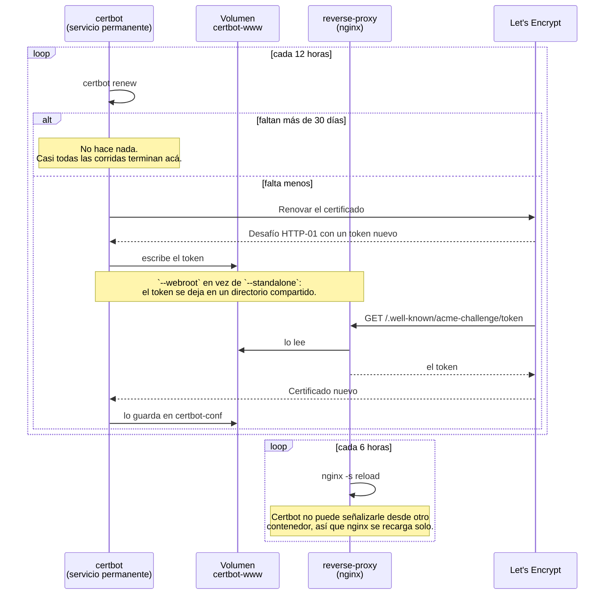

# Poner CityPass+ EDA online en Oracle Cloud

Guía paso a paso, de una cuenta recién creada a la aplicación funcionando en internet con
HTTPS. Once pasos, en orden, sin vueltas atrás: nada de lo que hacés acá se deshace después.

Cada paso dice qué esperar y qué hacer si no sale.

> **Esta carpeta se versiona, menos un archivo.** Todo lo de `oracle/` es genérico salvo
> `oracle/.env`, que está en `.gitignore` y es el **único** lugar con datos concretos:
> dominio, IP, mail y tokens. Para seguir esta guía, empezá creando ese archivo con tus
> valores —hay un ejemplo comentado en el que ya está—.
>
> El repositorio clonado en la instancia **no incluye el `.env` que usa el sistema**: se
> manda por SSH desde tu máquina, sin copiar archivos sueltos al disco remoto.

Lo que es común a cualquier proveedor está en
[docs/DEPLOYMENT.md](../docs/DEPLOYMENT.md) del repositorio.

---

## Contenido

1. [Antes de empezar](#1-antes-de-empezar)
2. [Crear la instancia](#2-crear-la-instancia)
3. [Conectarse](#3-conectarse)
4. [Verificar que la máquina esté lista](#4-verificar-que-la-máquina-esté-lista)
5. [El dominio](#5-el-dominio)
6. [Clonar y configurar](#6-clonar-y-configurar)
7. [Abrir los puertos](#7-abrir-los-puertos)
8. [Emitir el certificado](#8-emitir-el-certificado)
9. [Levantar](#9-levantar)
10. [Comprobar que funciona](#10-comprobar-que-funciona)
11. [No pasarse del límite gratuito](#11-no-pasarse-del-límite-gratuito)

---

## 1. Antes de empezar

Vas a necesitar tres cosas:

- **Una cuenta de Oracle Cloud.** Sirve tanto Always Free como Pay As You Go; en la segunda
  hay que cuidar de no salirse del cupo gratuito (paso 11).
- **Un dominio** apuntando a la instancia. Un subdominio gratuito de
  [DuckDNS](https://www.duckdns.org) alcanza. No es opcional: Let's Encrypt no emite
  certificados para una IP pelada, y sin certificado de una CA pública cada equipo que
  consuma Kafka tendría que instalar un truststore propio.
- **Un cliente SSH.**

Todo se hace desde tu máquina. Ningún paso pide copiar archivos a la instancia a mano.

---

## 2. Crear la instancia

En la consola de Oracle: *Compute → Instances → Create instance*.

| Campo | Valor | Por qué |
|---|---|---|
| Shape | `VM.Standard.A1.Flex` | Es el que entra en Always Free con recursos suficientes |
| OCPU / memoria | 2 OCPU · 12 GB | Ver más abajo |
| Imagen | Ubuntu 24.04 | La guía asume `apt` y `systemd` |
| Boot volume | 100–200 GB | El mínimo (~47 GB) alcanza, pero deja poco margen |
| Clave SSH | Descargar la privada | Oracle no la muestra dos veces |

**La arquitectura condiciona todo lo demás.** Las A1 son **ARM (`aarch64`)**, así que todas
las imágenes tienen que publicar `arm64`. Las doce que usa este sistema lo hacen —incluidas
`confluentinc/cp-kafka` y `cp-schema-registry`, que son las dudosas— así que no hay que
sustituir ninguna.

**Sobre el tamaño.** La suma de los techos de memoria del sistema es 6,5 GiB, así que 12 GB
dejan margen para el sistema operativo y el page cache, que en Kafka no es margen
desperdiciado: el broker se apoya fuerte en él. **El recurso escaso es la CPU**, no la
memoria: con 2 OCPU, lo que se degrada primero cuando hay carga es el broker.

**No confíes en ningún número de cupo que leas** —tampoco en los de esta guía—. Oracle viene
cambiando los límites de Always Free para las A1, y avisa con un banner en la consola cuando
lo hace. El único dato válido es el de tu cuenta, en *Governance → Limits, Quotas and Usage*,
filtrando por el servicio **Compute**. Ahí ves el cupo y cuánto llevás usado.

Lo que no cambia es la forma de gastarlo: **las OCPU se facturan por asignación, no por uso**,
así que una instancia encendida y ociosa consume igual que una con carga. Si el cupo no
alcanza para 2 OCPU todo el mes, la salida es bajar a 1 OCPU antes que apagarla a ratos.

> Si aparece **«Out of host capacity»**, no es un error tuyo: las A1 se agotan seguido en
> las regiones más pedidas. Se resuelve reintentando, a veces durante días. Por eso mismo,
> una vez que tengas la instancia **conviene no terminarla**: la capacidad asignada es mucho
> más fácil de conservar que de conseguir.

---

## 3. Conectarse

Con la clave que descargaste al crear la instancia:

```bash
chmod 600 ~/ruta/a/tu-clave.key
ssh -i ~/ruta/a/tu-clave.key ubuntu@TU_IP_PUBLICA
```

Conviene dejarlo configurado de una vez, porque el resto de la guía lo usa en cada paso:

```bash
mkdir -p ~/.ssh && printf 'Host citypass\n    HostName TU_IP_PUBLICA\n    User ubuntu\n    IdentityFile ~/ruta/a/tu-clave.key\n' >> ~/.ssh/config && chmod 600 ~/.ssh/config
```

A partir de acá alcanza con `ssh citypass`.

> Si trabajás en Windows con WSL, ojo: **son dos `~/.ssh` distintos**. Una clave que
> funciona desde PowerShell no la ve WSL. Copiala a WSL y dale permisos `600`; apuntar a
> `/mnt/c/...` no sirve porque ahí todo se ve como `0777` y `ssh` rechaza la clave.

---

## 4. Verificar que la máquina esté lista

**Desde tu máquina**, sin copiar nada:

```bash
ssh citypass 'bash -s' < oracle/preflight.sh
```

`bash -s` hace que bash lea el script de la entrada estándar, y `ssh` conecta tu archivo
local a esa entrada: el script viaja por la conexión y **no toca el disco remoto**. Por eso
este paso va antes de clonar.

No modifica nada, sólo informa. Repetilo hasta que diga **Todo listo**.

### Qué hacer con cada ✗

| Comprobación | Qué significa que falle | Qué hacer |
|---|---|---|
| `arquitectura` | La instancia no es Ampere; las imágenes ARM no van a arrancar | Recrearla como `VM.Standard.A1.Flex` |
| `memoria` | Menos de 10 GiB nominales | Bajar los `MEM_LIMIT_*`, empezando por `MEM_LIMIT_KAFKA_UI` |
| `memoria libre` | **La que importa.** Compara la memoria realmente disponible contra la suma de los `MEM_LIMIT_*`. Una instancia de cloud nunca tiene libre lo que dice el folleto: hay agentes del proveedor corriendo | Bajar los techos, o liberar memoria. La línea de abajo dice quién se la lleva |
| `mayor proceso ajeno` | No es un fallo: es el dato que explica un ✗ en `memoria libre`. En Oracle suele ser `unified-monitoring-agent`, que alimenta las métricas de la consola y ocupa ~80 MB | Si molestara, desactivar el plugin en *Compute → tu instancia → Oracle Cloud Agent*. **No borrar `/opt/unified-monitoring-agent`**: deja el servicio apuntando a archivos que no están |
| `carga` | La máquina ya está ocupada con el stack apagado | `ps -eo rss,comm --sort=-rss \| head` para ver qué corre |
| `disco` | Ubuntu no expandió el boot volume: la consola dice 200 GB y la raíz tiene ~45 | `sudo /usr/libexec/oci-growfs -y` |
| `reloj` | **Rompe la autenticación.** Los JWT llevan `iat` y `exp`; con el reloj corrido se rechazan tokens válidos, y el error no menciona nunca la hora | `sudo timedatectl set-ntp true` |
| `git` | No se puede clonar | `sudo apt-get install -y git` |
| `reinicio` | Hay un kernel nuevo instalado sin usar, o servicios con binarios viejos | `sudo reboot`. Hacelo ahora, con la máquina vacía: de paso comprueba que `docker al boot` funciona de verdad |
| `docker` | No está, o tu usuario no está en el grupo | Ver abajo |
| `compose` | El paquete `docker.io` de Ubuntu **no** trae Compose v2, va aparte | `sudo apt-get install -y docker-compose-v2` |
| `buildx` | Informativo, nunca falla: en la instancia no se compila, las imágenes se bajan de GHCR. Sólo hace falta si alguna vez querés construir a mano | `sudo apt-get install -y docker-buildx` |
| `cgroups` | El kernel no soporta límites de memoria: los `MEM_LIMIT_*` **se ignoran en silencio** | Raro en Ubuntu 24.04. Verificar que el kernel sea el de Oracle |
| `docker al boot` | Tras un reinicio —y Oracle reinicia por mantenimiento— no vuelve a levantar nada | `sudo systemctl enable --now docker` |
| `puertos libres` | Otro servicio ya escucha en un puerto del stack | `sudo ss -tlnp` para ver quién es; suele ser un nginx o apache previo |
| `expuesto al exterior` | Hay algo escuchando fuera de loopback que no es SSH ni el reverse-proxy. En las imágenes de cloud aparecen servicios que nadie pidió: **`rpcbind` en el 111** es el clásico —histórico vector de amplificación de DDoS, e inútil si no usás NFS—. Hoy lo tapa el firewall, pero es superficie que depende de que una sola capa esté bien | `sudo ss -tlnp` para identificarlo. Si nada depende de él: `sudo systemctl disable --now rpcbind.socket rpcbind.service` |
| `salida a internet` | No se puede clonar ni bajar dependencias | Revisar las reglas de salida de la VCN y el DNS |
| `iptables` | Hay reglas `ACCEPT` **después** de la de corte: se listan, se ven bien y no hacen nada | Ver el paso 7 |

### Instalar Docker

Si el paquete `docker.io` de Ubuntu ya está, lo que falta va aparte:

```bash
ssh citypass 'sudo apt-get update && sudo apt-get install -y docker-compose-v2 docker-buildx && sudo systemctl enable --now docker && sudo usermod -aG docker $USER'
```

Si no hay nada instalado, conviene el repositorio oficial. Se usa en vez del script de
conveniencia para no canalizar un script remoto a una shell con `sudo`:

```bash
ssh citypass 'sudo apt-get update && sudo apt-get install -y ca-certificates curl && sudo install -m 0755 -d /etc/apt/keyrings && sudo curl -fsSL https://download.docker.com/linux/ubuntu/gpg -o /etc/apt/keyrings/docker.asc && sudo chmod a+r /etc/apt/keyrings/docker.asc && echo "deb [arch=arm64 signed-by=/etc/apt/keyrings/docker.asc] https://download.docker.com/linux/ubuntu noble stable" | sudo tee /etc/apt/sources.list.d/docker.list > /dev/null && sudo apt-get update && sudo apt-get install -y docker-ce docker-ce-cli containerd.io docker-buildx-plugin docker-compose-plugin && sudo usermod -aG docker $USER'
```

No conviene tener las dos fuentes a la vez: terminás con dos instalaciones de `dockerd`
peleando por el mismo socket, y el síntoma —comandos que a veces andan y a veces no— no se
parece a la causa.

Después del `usermod` hay que **volver a conectarse** para que el grupo tome efecto.

---

## 5. El dominio

Hace falta un registro `A` apuntando a la **IP pública de la instancia**. Acá se usa
DuckDNS, que es gratuito y no pide tarjeta; con cualquier otro proveedor el resultado tiene
que ser el mismo.

### Crear el subdominio

En [duckdns.org](https://www.duckdns.org):

1. Entrar con una cuenta existente —GitHub, Google, Twitter o Reddit—. No hay registro
   propio ni contraseña que recordar.
2. Escribir el subdominio en la caja de **sub domain** y darle a **add domain**. Queda como
   `TU_SUBDOMINIO.duckdns.org`. La cuenta gratuita permite cinco.
3. Anotar el **token** que aparece arriba de todo. Es lo que autoriza a cambiar la IP.

> **El token es una credencial, no un identificador.** Permite repuntar cualquiera de tus
> dominios. Si termina en un chat, en el historial de la shell o en una captura de pantalla,
> regeneralo desde esa misma página con **recreate token**.

### Apuntarlo a la instancia

> **La trampa:** DuckDNS crea el dominio apuntando a **la IP desde la que abriste el
> navegador**, o sea tu conexión de casa. Queda «funcionando» y no es la que necesitás. Si no
> lo corregís, certbot va a intentar validar contra tu módem y el paso 8 falla con un error
> de conexión que no menciona el DNS por ningún lado.

La página tiene un botón **update ip**, pero conviene hacerlo con la llamada, que es
explícita sobre qué IP se está poniendo:

```bash
curl "https://www.duckdns.org/update?domains=TU_SUBDOMINIO&token=TU_TOKEN&ip=TU_IP_PUBLICA"
```

Ojo que `domains` va **sin** el `.duckdns.org`. Responde `OK` si lo tomó, y `KO` si el token
o el subdominio están mal.

### Comprobar antes de seguir

El certificado del paso 8 depende de que esto resuelva bien, así que no conviene avanzar a
ciegas:

```bash
getent hosts TU_DOMINIO
```

```
XXX.XXX.XXX.XXX    TU_SUBDOMINIO.duckdns.org
```

Esa IP tiene que ser la de tu instancia. Si no devuelve nada, esperá un minuto —el TTL de
DuckDNS es de 60 segundos— y volvé a intentar. Si devuelve otra IP, es la trampa de arriba.

### La IP se pone una vez

**No hace falta un actualizador de DNS dinámico.** La IP pública efímera de Oracle está
atada a la vida de la instancia, no a cada arranque: sobrevive a un reinicio y a un
stop/start, y sólo se libera si terminás la instancia —momento en el que el DNS es el menor
de los problemas—.

Es distinto de AWS, donde una IP sin Elastic IP cambia en cada stop/start. Ese reflejo es lo
que hace dudar, y acá no aplica.

Instalar un `ddupdate` o similar tendría además un costo concreto: obliga a guardar el token
de DuckDNS en la VM, y ese token puede repuntar todos tus dominios. Se cambiaría un riesgo
que casi no existe por una credencial más en disco.

Si querés red de seguridad igual, la barata es **reservar la IP** en *Networking → IP
Management → Reserved public IPs*: es un clic, no deja nada corriendo, y la IP deja de estar
atada a la instancia —te la llevás aunque algún día la recrees—.

---

## 6. Clonar y configurar

Clonar, en la instancia:

```bash
ssh citypass 'git clone https://github.com/carlos-illobre/citypass-event-gateway.git'
```

Queda en `~/citypass-event-gateway`, o sea el directorio donde caés al conectarte por SSH:
un `ls` al entrar te lo muestra. No hace falta `sudo` ni cambiar dueños, porque es tuyo.

Y ahora la configuración. Los valores salen de `oracle/.env`, el archivo con tus datos que
no se versiona:

```bash
set -a; . oracle/.env; set +a
sed -e "s|TU_DOMINIO|$DOMINIO|g" -e "s|TU_MAIL|$MAIL|g" oracle/.env.oracle \
  | ssh citypass 'cd ~/citypass-event-gateway && cat > .env && while grep -q "=CAMBIAR" .env; do sed -i "0,/=CAMBIAR/s//=$(openssl rand -hex 18)/" .env; done && echo ".env listo"'
```

Eso deja el `.env` completo: el dominio sustituido y una contraseña distinta generada para
Grafana y para kafka-ui. **No hay nada que editar a mano en la instancia.**

Tres detalles del comando, por si algo falla:

- El `sed` corre **en tu máquina** y el resultado viaja por la conexión, así que
  `oracle/.env.oracle` queda intacto con sus marcadores, listo para la próxima instancia.
- `cat > .env` **reemplaza** el archivo si ya existía, sin preguntar. Correrlo de nuevo es la
  forma normal de reconfigurar; el costo es que **genera contraseñas nuevas**, así que las de
  Grafana y kafka-ui cambian en cada envío.
- El bucle reemplaza los `CAMBIAR` **de a uno** —`0,/…/` acota el `sed` a la primera
  coincidencia— porque una sola pasada con `s///g` pondría el mismo valor en los dos.
- Usa `-hex` y no `-base64` porque el alfabeto base64 incluye `/`, que rompería el `sed` al
  aparecer dentro del reemplazo.

Para ver las contraseñas que quedaron:

```bash
ssh citypass 'grep -E "^(KAFKA_UI|GRAFANA)_(USER|PASSWORD)=" ~/citypass-event-gateway/.env'
```

Y para confirmar que no quedó ningún marcador sin reemplazar — los guardas `:?` del compose
detectan una variable **ausente**, no una con el valor sin cambiar:

```bash
ssh citypass 'grep -nE "^[A-Z_]+=(CAMBIAR|.*TU_DOMINIO|TU_MAIL)" ~/citypass-event-gateway/.env || echo "OK: configuración completa"'
```

El `^[A-Z_]+=` no es adorno: acota la búsqueda a las **asignaciones**. Sin él, cualquier
comentario que mencione un marcador se reporta como pendiente.

---

## 7. Abrir los puertos

Hay que abrirlos **en dos lugares**, y olvidarse de uno es el clásico «lo abrí en la consola
y sigue sin responder».

Sólo estos tres:

| Puerto | Para qué |
|---|---|
| 80 | Desafío de Let's Encrypt y redirección a HTTPS |
| 443 | API, interfaz y servicio de identidad |
| 9092 | Kafka sobre TLS |

Los demás —8080, 8081, 8083, 8084, 8090, 9090, 9091 y 3000— **no se abren**. El Schema
Registry y kafka-ui no tienen autenticación propia: expuestos, cualquiera podría borrar
subjects o administrar el cluster. Quedan alcanzables sólo desde la propia VM.

**En la consola.** OCI tiene dos lugares donde filtrar, y hay que saber cuál aplica:

| | Se ata a | Cuándo manda |
|---|---|---|
| **Security List** | el subnet | Siempre, salvo que la VNIC tenga un NSG |
| **Network Security Group** | la VNIC | Sólo si le asignaste uno |

En una instancia creada por defecto no hay NSG, así que las reglas van en la **Security
List del subnet**.

El camino corto es desde la página de la instancia, sin buscar en el menú —las redes están
bajo *Networking*, no bajo *Compute*, y es el primer lugar donde uno se pierde—:

1. En *Compute → Instances → tu instancia*, el campo **Subnet** es un enlace. Clic ahí.
2. En la página del subnet, pestaña **Security** —arriba, junto a *Details*—. Las security
   lists están ahí; en versiones anteriores de la consola aparecían en un panel de recursos
   a la izquierda, y es el cambio que más desorienta.
3. Clic en la security list (normalmente *Default Security List for vcn-…*).
4. Botón **Add Ingress Rules**.
5. Una regla por puerto. Con **+ Another Ingress Rule** entran las tres en un solo diálogo:

| Campo | Valor |
|---|---|
| Stateless | **desmarcado** |
| Source Type | CIDR |
| Source CIDR | `0.0.0.0/0` |
| IP Protocol | TCP |
| Source Port Range | vacío |
| Destination Port Range | `80`, y otra con `443`, y otra con `9092` |

Ahí ya vas a ver la regla del puerto 22, la que te deja entrar por SSH: las nuevas llevan la
misma forma.

Entrar por el enlace del subnet y no por el menú tiene una ventaja concreta: muestra **las
security lists realmente atadas a ese subnet**. Una VCN puede tener varias, y editar la que
no corresponde deja reglas que no aplican a nada y un problema que no se ve.

**Dejá `Stateless` desmarcado.** Con reglas *stateful* el tráfico de vuelta se permite solo;
marcándolo habría que abrir también el camino de salida a mano.

> **No uses el *quick action* «Connect public subnet to internet».** Es para subnets que no
> tienen internet gateway. Si ya entrás por SSH, el tuyo lo tiene: correrlo agregaría un NSG
> y podría reescribir la route table, o sea cambiar una configuración que funciona. Es el
> botón que parece la solución y es el que la rompe.

**En la instancia**, y acá está la trampa fina: la regla que bloquea es un `REJECT` general,
y **todo lo que viene después de ella es inalcanzable**. Como `iptables -A` agrega al final,
abrir un puerto así deja una regla que se lista, se ve bien y no hace nada. Hay que
**insertar antes** del `REJECT`.

Primero, ver en qué línea está:

```bash
ssh citypass 'sudo iptables -L INPUT -n -v --line-numbers'
```

Normalmente es la 5. Usá ese número en los tres `-I`:

```bash
ssh citypass 'sudo iptables -I INPUT 5 -p tcp -m state --state NEW --dport 80 -j ACCEPT && sudo iptables -I INPUT 5 -p tcp -m state --state NEW --dport 443 -j ACCEPT && sudo iptables -I INPUT 5 -p tcp -m state --state NEW --dport 9092 -j ACCEPT && sudo netfilter-persistent save'
```

Sin el `netfilter-persistent save` las reglas no sobreviven a un reinicio.

Para comprobar que quedaron **antes** del corte:

```bash
ssh citypass 'sudo iptables -L INPUT -n --line-numbers'
```

Las tres tienen que aparecer con número menor que el del `REJECT`. Si alguna quedó después,
no sirve para nada: borrala y volvé a insertarla.

---

## 8. Emitir el certificado

Hay un orden obligatorio: nginx no arranca sin certificado, y certbot necesita el puerto 80,
que después usa nginx. Por eso la primera emisión va **antes** de levantar el stack:

```bash
ssh citypass 'cd ~/citypass-event-gateway && set -a && . ./.env && set +a && docker compose run --rm --entrypoint certbot -p 80:80 certbot certonly --standalone --cert-name citypass -d "$PUBLIC_DOMAIN" --email "$CERTBOT_EMAIL" --agree-tos --no-eff-email -n'
```

El nombre `citypass` es fijo a propósito: la configuración de nginx referencia
`/etc/letsencrypt/live/citypass/`, así que no depende del dominio.

**`--entrypoint certbot` no es opcional.** El servicio tiene como entrypoint el bucle de
renovación, y `docker compose run` reemplaza el *command*, no el entrypoint: sin esa opción
los argumentos quedan como parámetros posicionales que el bucle ignora, y el contenedor se
queda renovando nada para siempre. No falla, no imprime —el bucle usa `--quiet`— y no
escucha en ningún puerto. Se reconoce porque `docker ps` lo muestra activo minutos después.

De acá en adelante el certificado **se renueva solo**: el servicio `certbot` lo intenta cada
12 horas —Let's Encrypt sólo renueva cuando faltan menos de 30 días— y nginx se recarga cada
6 horas para tomar el nuevo.

### Quién es quién

| | Qué es |
|---|---|
| **Let's Encrypt** | Una autoridad certificadora (CA) gratuita. Los navegadores confían en ella de fábrica, así que un certificado que firme es un candado válido |
| **ACME** | El protocolo con el que se pide un certificado sin intervención humana. Define cómo la CA te pone a prueba y cómo respondés |
| **certbot** | El cliente de ACME. Es quien genera tus claves, habla con la CA y guarda el resultado |
| **Desafío HTTP-01** | La prueba concreta: la CA te da un token y lo busca en `http://tu-dominio/.well-known/acme-challenge/<token>`. Si lo encuentra, controlás el dominio |
| **`privkey.pem`** | Tu clave privada. **Nunca sale de la máquina** |
| **`fullchain.pem`** | Tu certificado firmado, más la cadena hasta la raíz en la que confía el navegador |

Todo el diseño se apoya en una idea: **la CA no puede verificar quién sos, pero sí puede
verificar que controlás el dominio**, y para eso entra desde internet como lo haría
cualquiera. Por eso el DNS tiene que resolver a la instancia y el puerto 80 tiene que estar
abierto: la validación **entra desde afuera**, no sale desde adentro.

### La emisión, paso a paso



Fijate que **la clave privada nunca viaja**. Certbot genera el par localmente y a la CA sólo
le manda la parte pública dentro de un pedido de firma. Let's Encrypt firma algo que nunca
vio en secreto.

### La renovación, que es la misma idea con un cambio

El certificado dura 90 días, así que esto tiene que pasar solo. Y hay un detalle que obliga a
hacerlo distinto: **ahora nginx ocupa el puerto 80**, así que certbot ya no puede levantar el
suyo.



Los dos bucles son independientes a propósito: certbot y nginx viven en contenedores
distintos y no pueden mandarse señales. En vez de acoplarlos, cada uno hace lo suyo con un
temporizador, y una recarga sin cambios no corta ninguna conexión.

Por eso el aviso de certbot —«you may need to take steps to enable automatic renewal»— no
aplica acá: lo dice porque no encuentra un temporizador de systemd, pero el bucle del compose
ya cumple esa función.

> Si esto falla con un error de conexión, casi siempre es el paso 7: o falta la regla en la
> consola de Oracle, o la de iptables quedó después del `REJECT`.

---

## 9. Levantar

Las imágenes ya están construidas: el pipeline del repositorio las publica en GHCR en
runners ARM nativos, y la etiqueta `latest` apunta a **la última versión que pasó los
tests**. La instancia sólo las descarga.

> **Requisito:** los paquetes de GHCR nacen **privados** aunque el repositorio sea público.
> Marcalos públicos en *github.com/TU_USUARIO?tab=packages* → cada paquete → *Package
> settings* → *Change visibility*. Si no, el `pull` va a pedir credenciales y hay que hacer
> `docker login ghcr.io` en la instancia con un token de acceso personal.

```bash
ssh citypass 'cd ~/citypass-event-gateway && docker compose pull && docker compose up -d --no-build'
```

Tarda un par de minutos, casi todo bajando imágenes.

**En la instancia nunca se compila**, y `--no-build` es lo que lo garantiza: si faltara una
imagen, esto falla en vez de ponerse a construirla. Compilar sobre dos núcleos dejaría la
aplicación degradada mientras dura el build, llenaría el disco de caché y, si fallara, te
dejaría sin ambiente.

> Si el `pull` da `denied` o `unauthorized`, es lo del requisito de arriba: los paquetes
> siguen privados.

## 10. Comprobar que funciona

Cinco comprobaciones, de la más simple a la más completa. Conviene hacerlas en orden: cada
una descarta una capa, así que la primera que falle te dice dónde mirar.

### 10.1 · Los contenedores

```bash
ssh citypass 'cd ~/citypass-event-gateway && docker compose ps'
```

`event-gateway` tiene que figurar `healthy` —es el último en levantar, porque depende de
Kafka y del Schema Registry—. Y mirá la columna `PORTS`: **sólo `reverse-proxy` debe tener
`0.0.0.0`**; todos los demás, `127.0.0.1`.

### 10.2 · Responde por HTTPS

```bash
curl https://TU_DOMINIO/health
```

```json
{ "status": "UP", "service": "event-gateway" }
```

Sin `-k`. Si hiciera falta ignorar el certificado, el certificado estaría mal.

### 10.3 · El certificado es el correcto

```bash
echo | openssl s_client -connect TU_DOMINIO:443 -servername TU_DOMINIO 2>/dev/null | openssl x509 -noout -subject -issuer -dates
```

```
subject=CN=TU_DOMINIO
issuer=C=US, O=Let's Encrypt, CN=...
notBefore=...   notAfter=...   (90 dias despues)
```

Que el `subject` sea tu dominio y el `issuer` sea Let's Encrypt es lo que distingue un
certificado válido de uno autofirmado, que el navegador rechazaría.

### 10.4 · No se expuso nada de más

La más importante de todas:

```bash
for p in 22 80 443 3000 5173 8080 8081 8083 8084 8090 9090 9091 9092 19092; do timeout 3 bash -c "</dev/tcp/TU_DOMINIO/$p" 2>/dev/null && echo "$p ABIERTO" || echo "$p cerrado"; done
```

Lo único que puede decir `ABIERTO` es **22, 80, 443 y 9092**. Si aparece cualquier otro,
**parar acá**: el 8081 es el Schema Registry, el 8090 kafka-ui y el 3000 Grafana, y ninguno
tiene autenticación suficiente para estar en internet. Que aparezca significa que falló
alguna de las tres capas —`PUBLISH_ADDR`, iptables o la security list— y hay que encontrar
cuál antes de seguir.

También, que el HTTP redirija en vez de servir:

```bash
curl -sI http://TU_DOMINIO/ | head -1
```

Tiene que decir `301 Moved Permanently`.

### 10.5 · El recorrido completo

Prueba la cadena entera: nginx, TLS, el simulador de identidad, el gateway, el Schema
Registry y Kafka.

```bash
TOKEN=$(curl -s -X POST https://TU_DOMINIO/auth/oauth/token -u grupo3:grupo3 -d grant_type=client_credentials | python3 -c 'import sys,json;print(json.load(sys.stdin)["access_token"])'); echo "${TOKEN:0:40}..."
```

```bash
curl -s -X POST https://TU_DOMINIO/api/v1/event-types -H "Authorization: Bearer $TOKEN" -H 'Content-Type: application/json' -d '{"name":"PruebaDespliegue","fields":[{"name":"id","type":"string"}]}' -w '\nHTTP %{http_code}\n'
```

```bash
curl -s -X POST https://TU_DOMINIO/api/v1/event-types/com.citypass.movilidad.PruebaDespliegue/events -H "Authorization: Bearer $TOKEN" -H 'Content-Type: application/json' -d '{"id":"1"}' -w '\nHTTP %{http_code}\n'
```

`201` en los dos. El segundo devuelve el evento con su `metadata` —`eventId`, `payloadHash`,
`schemaId`—, que es la prueba de que se serializó contra el schema registrado y llegó a
Kafka.

> Si da **401**, acordate de la limitación del mock: `auth-simulator` regenera su clave de
> firma en cada arranque, así que un token pedido antes del último reinicio ya no vale. Pedí
> uno nuevo.

Y para limpiar el event type de prueba:

```bash
curl -s -X DELETE https://TU_DOMINIO/api/v1/event-types/com.citypass.movilidad.PruebaDespliegue -H "Authorization: Bearer $TOKEN" -w 'HTTP %{http_code}\n'
```

### 10.6 · Que la renovación del certificado va a funcionar

La comprobación menos evidente y la que más ahorra: **el camino de la renovación no es el
mismo que el de la emisión**. La primera vez usaste `--standalone`, con certbot levantando su
propio servidor. Las renovaciones usan `--webroot`: certbot escribe el token en el volumen
`certbot-www` y **nginx** lo sirve.

Ese segundo camino no se ejercitó todavía, y si estuviera mal fallaría **en silencio** —el
bucle corre con `--quiet`— dentro de dos meses, cuando el certificado esté por vencer.

```bash
ssh citypass 'cd ~/citypass-event-gateway && docker compose run --rm --entrypoint certbot certbot renew --webroot -w /var/www/certbot --dry-run'
```

Tiene que terminar con `Congratulations, all simulated renewals succeeded`. El `--dry-run`
hace el trámite completo contra el servidor de pruebas de Let's Encrypt —pide el desafío,
escribe el token, deja que lo vengan a buscar por el puerto 80— y lo único que no hace es
guardar el certificado. **No cuenta contra los límites de emisión**, así que se puede repetir.

Y que el servicio que hará el trabajo esté corriendo:

```bash
ssh citypass 'cd ~/citypass-event-gateway && docker compose ps certbot'
```

#### Qué pasa si algún día falla igual

La red de seguridad no depende de vos: **Let's Encrypt manda avisos** al `CERTBOT_EMAIL` a
los 20 días del vencimiento, a los 10 y al último. Por eso esa variable no era un trámite.

El síntoma, si llegara a vencer: el sitio **no se cae**, pero nginx sigue sirviendo un
certificado vencido y el navegador muestra la advertencia a pantalla completa. Los clientes de
Kafka que verifiquen TLS se niegan a conectar. Queda inutilizable sin estar caído, que es la
peor combinación para diagnosticar.

Se arregla emitiendo a mano, como la primera vez, pero **parando nginx antes** porque
`--standalone` necesita el puerto 80 y esta vez está ocupado:

```bash
ssh citypass 'cd ~/citypass-event-gateway && docker compose stop reverse-proxy && set -a && . ./.env && set +a && docker compose run --rm --entrypoint certbot -p 80:80 certbot certonly --standalone --cert-name citypass -d "$PUBLIC_DOMAIN" --email "$CERTBOT_EMAIL" --agree-tos --no-eff-email -n --force-renewal && docker compose start reverse-proxy'
```

### En el navegador

**`https://TU_DOMINIO`**, con cualquiera de las credenciales del simulador (`grupo3` /
`grupo3`, por ejemplo).

**Ya está online.**

### Grafana, kafka-ui y Prometheus

No están publicados a propósito, y conviene tener presente por qué mientras los usás:
**kafka-ui puede borrar tópicos y administrar el cluster entero**, y su única defensa es un
usuario y una contraseña. Grafana expone las métricas de todos los grupos. Publicarlos «un
rato para mostrar algo» convierte esa contraseña en lo único que separa el cluster de
internet.

Se llega por un túnel SSH. Las contraseñas se generaron al azar en el paso 6:

```bash
ssh citypass 'grep -E "^(KAFKA_UI|GRAFANA)_(USER|PASSWORD)=" ~/citypass-event-gateway/.env'
```

```bash
ssh -N -L 3001:127.0.0.1:3000 -L 8091:127.0.0.1:8090 -L 9191:127.0.0.1:9091 citypass
```

| | En el navegador |
|---|---|
| Grafana | http://localhost:3001 |
| kafka-ui | http://localhost:8091 |
| Prometheus | http://localhost:9191 |

**Los puertos locales están corridos a propósito.** Si tenés el sistema corriendo en tu
máquina para desarrollar, ya ocupa el 3000, el 8090 y el 9091, y el túnel fallaría con
`bind: Address already in use`. Con 3001, 8091 y 9191 conviven sin chocar, y de paso no hay
forma de confundir el Grafana local con el de la instancia.

`-N` significa «no ejecutes nada, sólo reenviá», así que esa terminal queda ocupada mientras
el túnel viva. Agregale `-f` para mandarlo al fondo.

Si lo vas a usar seguido, conviene un alias aparte en `~/.ssh/config`:

```
Host citypass-paneles
    HostName TU_IP_PUBLICA
    User ubuntu
    IdentityFile ~/ruta/a/tu-clave.key
    LocalForward 3001 127.0.0.1:3000
    LocalForward 8091 127.0.0.1:8090
    LocalForward 9191 127.0.0.1:9091
```

Y después alcanza con `ssh -N citypass-paneles`.

Va en un alias **separado** y no dentro de `citypass` por una razón práctica: con los
`LocalForward` en el alias principal, cada `ssh citypass ...` de esta guía intentaría abrir
los tres puertos, y el segundo comando simultáneo fallaría porque ya están tomados.

---

## 11. No pasarse del límite gratuito

En una cuenta **Pay As You Go** los recursos gratuitos conviven con los que se cobran:

- **Revisá tu cupo real**, en *Governance → Limits, Quotas and Usage*, servicio **Compute**.
  Oracle lo ha cambiado más de una vez para las A1, así que cualquier cifra publicada —acá o
  en un blog— puede estar vieja.
- **Alerta de presupuesto en 1 USD**, en *Billing → Budgets*. No impide el gasto, pero avisa
  el mismo día en vez de a fin de mes.
- **Revisar Cost Analysis** el primer mes. Tiene que decir 0,00.
- **Las OCPU se facturan por asignación, no por uso.** Una instancia encendida y ociosa
  consume su cupo igual.
- **El disco es un techo duro.** El boot volume gratuito coincide con el cupo total de
  almacenamiento: si se llena no se puede agrandar sin pagar. Lo acotan tres cosas, todas en
  el `.env`: la rotación de los logs de contenedores, la retención de Kafka por tamaño, y el
  rate limit por namespace multiplicado por el tamaño máximo del evento.

---

## Operación diaria

```bash
ssh citypass 'cd ~/citypass-event-gateway && docker compose ps'
```

```bash
ssh citypass 'cd ~/citypass-event-gateway && docker compose logs -f event-gateway'
```

Actualizar a la última versión verificada de `main`:

```bash
bash oracle/deploy.sh
```

Y para volver a una versión anterior, o desplegar un commit concreto:

```bash
bash oracle/deploy.sh SHA_DEL_COMMIT
```

El script despliega **por SHA y no por `latest`**, así el `.env` de la instancia dice
exactamente qué versión hay corriendo y el rollback es determinístico. Hace, en orden: deja
el checkout en ese commit —el compose y lo que monta salen de ahí, no de las imágenes—, baja
las imágenes, reemplaza sólo los contenedores cuya imagen cambió, y espera a que
`event-gateway` quede `healthy`. Si las imágenes no están todavía en el registro, restaura el
`TAG` anterior y aborta sin tocar ningún contenedor.

`oracle/deploy.sh` está en `.gitignore`. No contiene datos —los lee de `oracle/.env`— así que
podés versionarlo sacando esa línea si te resulta más cómodo.

Si preferís hacerlo a mano, son los dos `pull`:

```bash
ssh citypass 'cd ~/citypass-event-gateway && git pull && docker compose pull && docker compose up -d --no-build'
```

Hacen falta los dos: el de git trae la configuración y el de docker las imágenes. Si sólo
bajaras las imágenes, un cambio en el compose no se aplicaría **y el despliegue diría que
salió bien**.

Si cambiás el `oracle/.env.oracle` de tu máquina, la instancia **no se entera**: un `git
pull` allá trae la plantilla, pero el `.env` que usa el sistema se genera a partir de ella y
no se rehace solo. Hay que volver a mandarlo con el comando del paso 6, que **reemplaza el
`.env` remoto** sin preguntar.

Después de reenviarlo hace falta `docker compose up -d` para que los contenedores tomen los
valores nuevos. Y tené presente que **las contraseñas de Grafana y kafka-ui cambian**: se
generan de nuevo en cada envío. Volvé a consultarlas con el comando del paso 6.
